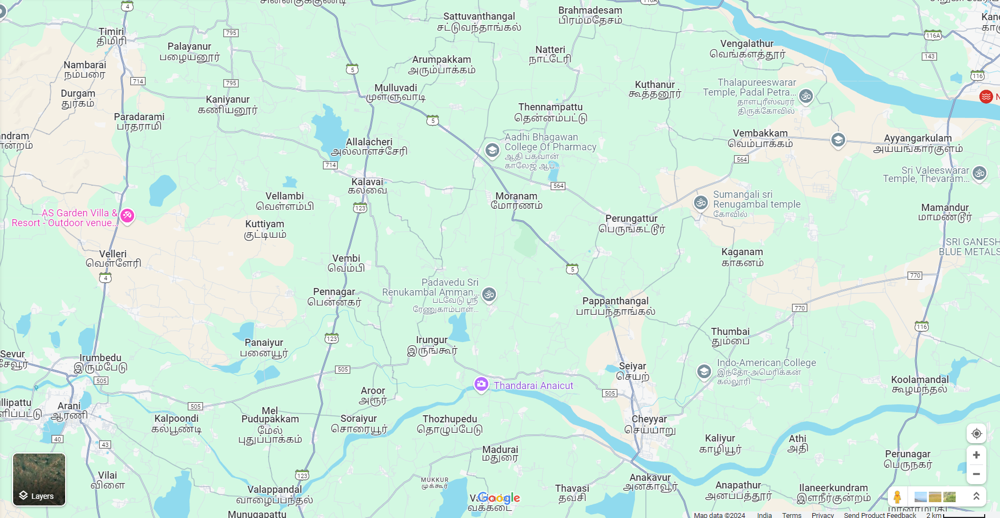
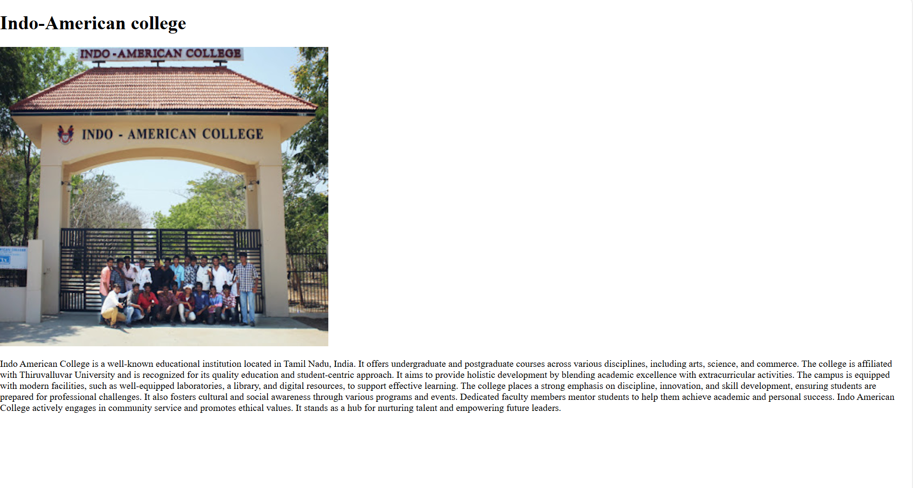
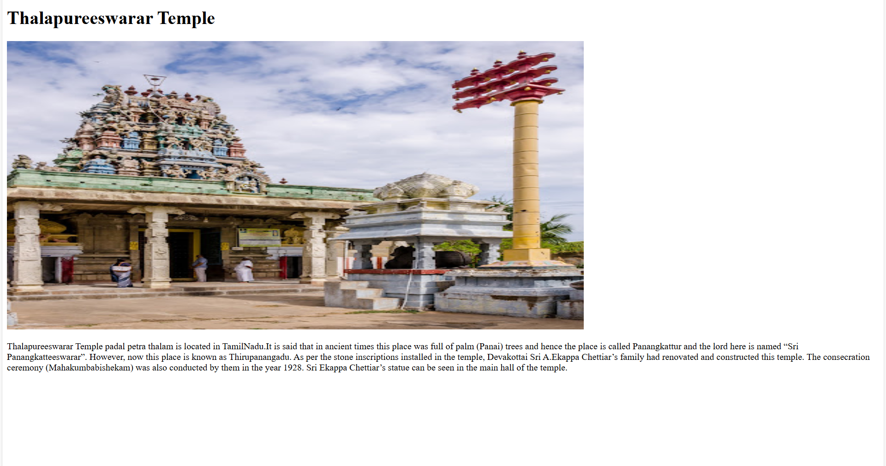
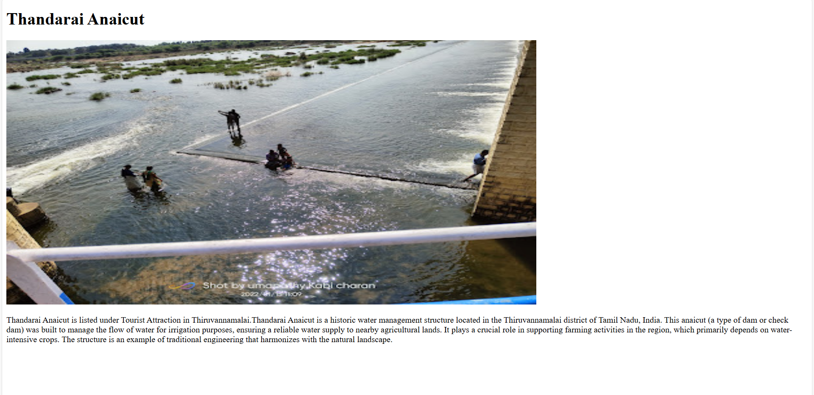

# Ex04 Places Around Me
# Date:15/04/25
# AIM:
To develop a website to display details about the places around my house.

# DESIGN STEPS
## STEP 1
Create a Django admin interface.

## STEP 2
Download your city map from Google.

## STEP 3
Using <map> tag name the map.

## STEP 4
Create clickable regions in the image using <area> tag.

## STEP 5
Write HTML programs for all the regions identified.

## STEP 6
Execute the programs and publish them.

# CODE
```
map.html

<!DOCTYPE html>
<html lang="en">
<head>
    <meta charset="UTF-8">
    <meta name="viewport" content="width=device-width, initial-scale=1.0">
    <title>IMAGE MAPPING</title>
</head>
<body>
    <h1>Explore Locations Around My House</h1>
    <p>Click on the marked locations to learn more about each place.</p>
    
    
    
    <map name="image-map">
        <area target="" alt="Indo-American College" title="Indo-American College" href="index1.html" coords="1358,782,1344,1014,1792,779" shape="poly"></area>
        <area target="" alt="Aadhi Bhagawan College of Pharmacy" title="Aadhi Bhagawan College of Pharmacy" href="index2.html"coords="961,387,939,604,1326,447,1285,438" shape="poly"></area> 
        <area target="" alt="AS Garden Villa & Resort" title="AS Garden Villa & Resort" href="index3.html"coords="140,505,86,682,538,605" shape="poly"></area> 
        <area target="" alt="Thalapureeswarar Temple" title="Thalapureeswarar Temple" href="index4.html" coords="1353,323,1442,520,1765,284" shape="poly"></area>
        <area target="" alt="Thandarai Anaicut" title="Thandarai Anaicut" href="index5.html"coords="945,807,1172,794,1176,952,942,945" shape="poly"></area> 
    </map>
    </body>
</html>

index1.html

<!DOCTYPE html>
<html lang="en">
    <head>
        <meta charset="UTF-8">
        <meta name=""viewport" content="width=device-width,initial-scale=1.0">
        <title>Indo-American college</title>
    </head>
    <body>
        <h1>Indo-American college</h1>
        
        <p>Indo American College is a well-known educational institution located in Tamil Nadu, India. It offers undergraduate and postgraduate courses across various disciplines, including arts, science, and commerce. The college is affiliated with Thiruvalluvar University and is recognized for its quality education and student-centric approach. It aims to provide holistic development by blending academic excellence with extracurricular activities.

            The campus is equipped with modern facilities, such as well-equipped laboratories, a library, and digital resources, to support effective learning. The college places a strong emphasis on discipline, innovation, and skill development, ensuring students are prepared for professional challenges. It also fosters cultural and social awareness through various programs and events. Dedicated faculty members mentor students to help them achieve academic and personal success. Indo American College actively engages in community service and promotes ethical values. It stands as a hub for nurturing talent and empowering future leaders.</p>
    </body>
</html>

index2.html

<!DOCTYPE html>
<html lang="en">
    <head>
        <meta charset="UTF-8">
        <meta name=""viewport" content=""width=device-width,initial-scale=1.0">
        <title>Aadhi Bhagawan college of Pharmacy</title>
    </head>
    <body>
        <h1>Aadhi Bhagawan college of Pharmacy</h1>
        
        <p>Aadhi Bhagawan College of Pharmacy, located in Tamil Nadu, is a premier institution dedicated to pharmaceutical education and research. It offers diploma, undergraduate, and postgraduate programs in pharmacy, equipping students with in-depth knowledge and practical skills. The college is affiliated with The Tamil Nadu Dr. M.G.R. Medical University and approved by the Pharmacy Council of India (PCI).

            With state-of-the-art laboratories, a comprehensive library, and experienced faculty, the college fosters academic excellence and innovation. It emphasizes hands-on training and encourages students to engage in research projects to address real-world healthcare challenges. The institution also organizes workshops, seminars, and industrial visits to enhance industry exposure. Its mission is to produce competent and ethical pharmacy professionals who contribute to the healthcare sector. Aadhi Bhagawan College of Pharmacy is known for its focus on holistic development and community service. It is a hub for aspiring pharmacists to build successful careers.</p>
</body>
</html>

index3.html

<!DOCTYPE html>
<html lang="en">
    <head>
        <meta charset="UTF-8">
        <meta name=""viewport" content=""width=device-width,initial-scale=1.0">
        <title>AS Garden villa & Resort</title>
    </head>
    <body>
        <h1>AS Garden villa & Resort</h1>
        
        <p>AS Garden villa & Resort is a premium holiday destination offers an exclusive experience perfect for family.Located in the heart of Thamaraipakkam, this premium holiday destination offers an exclusive experience perfect for family getaways, weddings, and events. With greenish gardens and a stunning natural beauty environment, AS Garden Villa is the perfect place to unwind and relax. One can start a day with warm sunshine, enjoy the cool breeze, and take in the peaceful ambiance that surrounds you. And that's not all - the resort is also strategically located reachable to popular tourist places, however, you will never run out of things to do. Whether you're seeking a romantic retreat, a family vacation, or a stunning venue for your special occasion, AS Garden Villa has got you covered. Book your stay today and experience the ultimate in luxury and hospitality!</p>
</body>
</html>

index4.html

<!DOCTYPE html>
<html lang="en">
    <head>
        <meta charset="UTF-8">
        <meta name=""viewport" content=""width=device-width,initial-scale=1.0">
        <title>Thalapureeswarar Temple</title>
    </head>
    <body>
        <h1>Thalapureeswarar Temple</h1>
        
        <p>Thalapureeswarar Temple padal petra thalam is located in TamilNadu.It is said that in ancient times this place was full of palm (Panai) trees and hence the place is called Panangkattur and the lord here is named “Sri Panangkatteeswarar”. However, now this place is known as Thirupanangadu. As per the stone inscriptions installed in the temple, Devakottai Sri A.Ekappa Chettiar’s family had renovated and constructed this temple. The consecration ceremony (Mahakumbabishekam) was also conducted by them in the year 1928. Sri Ekappa Chettiar’s statue can be seen in the main hall of the temple.</p>
</body>
</html>

index5.html

<!DOCTYPE html>
<html lang="en">
    <head>
        <meta charset="UTF-8">
        <meta name=""viewport" content=""width=device-width,initial-scale=1.0">
        <title>Thandarai Anaicut</title>
    </head>
    <body>
        <h1>Thandarai Anaicut</h1>
        
        <p>Thandarai Anaicut is listed under Tourist Attraction in Thiruvannamalai.Thandarai Anaicut is a historic water management structure located in the Thiruvannamalai district of Tamil Nadu, India. This anaicut (a type of dam or check dam) was built to manage the flow of water for irrigation purposes, ensuring a reliable water supply to nearby agricultural lands. It plays a crucial role in supporting farming activities in the region, which primarily depends on water-intensive crops. The structure is an example of traditional engineering that harmonizes with the natural landscape.</p>
</body>
</html>
```
# OUTPUT






# RESULT
The program for implementing image maps using HTML is executed successfully.
